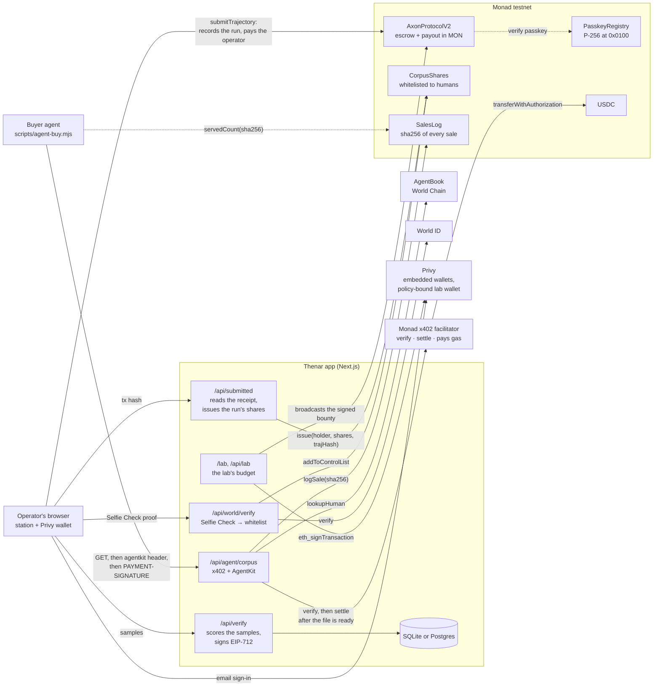

# Thenar on Monad

**Robot training data, recorded by people, owned by the people who recorded it,
and bought by agents.** An operator drives a robot arm in the browser; a
verifier scores the recording against the goal and signs; one Monad transaction
records the trajectory and pays the operator from escrowed MON, in under a
second. A World ID Selfie Check puts that operator on the corpus' share
whitelist, and every paid run issues their share of the corpus. An AI agent that
wants a task's corpus asks for it over HTTP, is answered `402`, and either pays
a cent of USDC on Monad through x402 or shows through World AgentKit that a
verified human stands behind it. Every sale is logged on Monad with the sha256
of the bytes served. A lab funds bounties from a Privy wallet whose policy lets
it spend on nothing else.

Thenar was built at **Monad Blitz Hyderabad V3 (3rd place)** on Monad testnet,
built out on Avalanche Fuji afterwards, and has now come back to Monad for
**Metropolis**, Track 4: Trust, Identity & AI Infrastructure. The git history
says which is which: the Blitz commits, then one squashed commit for the
Avalanche build, then the move back.

| | |
| --- | --- |
| **Chain** | Monad testnet, chain `10143`. Bounties, payouts, dividends and gas are MON. |
| **Contracts** | [`lib/deployment.ts`](lib/deployment.ts), written from forge's broadcast record by [`scripts/apply-deploy.mjs`](scripts/apply-deploy.mjs). Every address below comes from there. |
| **Corpus shares** | [`CorpusShares`](contracts/src/CorpusShares.sol): a token only World ID-verified humans can hold; shares per paid run, by score; dividends in MON at a record date fixed in advance |
| **Agent payments** | x402 `exact` in USDC on Monad, settled by the [Monad facilitator](https://x402-facilitator.molandak.org/supported), which pays the gas |
| **Sales log** | [`SalesLog`](contracts/src/SalesLog.sol): every pull, with the sha256 of the file served, in storage and in events |
| **Identity** | World ID Selfie Check for operators; World AgentKit and AgentBook (World Chain 480) for agents |
| **Wallets** | Privy: operators sign in with an email and get an embedded wallet on Monad; a lab's budget is a Privy server wallet whose policy only lets it fund bounties |
| **Repo** | https://github.com/nickthelegend/thenar-monad |
| **Submission** | [SUBMISSION.md](SUBMISSION.md) |

---

## What Monad does here that another chain would not

Each of these is load-bearing, and each has a place in the code shaped by it.

| Monad property | Where it shows |
| --- | --- |
| **Sub-second, single-slot finality** | A run is paid in the block that records it, and the station reports the settlement latency it measured. A share issue and a sales-log write each land a moment later, so the station shows the payout and the share in one panel instead of promising the second. |
| **Parallel execution** | `AxonProtocolV2` shards its slot counter: each operator's submit writes only its own shard, so two runs on one task touch no common storage and execute side by side. |
| **P-256 precompile at `0x0100`** | `PasskeyRegistry` verifies a browser passkey's secp256r1 signature on chain, and a run can be authorised with it. See `/passkey`. |
| **Gas charged on the limit** | Gas limits are estimated plus a tenth, never doubled; the station and `/post` quote the cost from receipts, and the low-balance floor is one constant. |
| **100-block `eth_getLogs` cap on public RPCs** | History is read from contract storage through Multicall3, not from logs. A run and a task each record the block they were made in, so a transaction hash is a one-block log query every endpoint answers. `SalesLog` keeps every sale in storage for the same reason. |
| **Cheap enough for a one-cent sale** | An agent pays one cent of USDC per corpus; the facilitator pays the gas and the sale is final before the response is sent. |

---

## Architecture



---

## Contracts

All deployed by [`contracts/script/DeployMonad.s.sol`](contracts/script/DeployMonad.s.sol)
in one broadcast. The addresses are in [`lib/deployment.ts`](lib/deployment.ts);
an empty address there means not deployed yet, and every page says so.

| Contract | Does |
| --- | --- |
| AxonProtocolV2 | Tasks, escrow, trajectories, payouts, policies, cap tables. Records a run and pays it in one call. Relayed runs and passkey-authorised runs. |
| CorpusShares | New for Metropolis. The corpus as shares, whitelisted to verified humans, issued per run by score, with snapshot dividends in MON. |
| SalesLog | New for Metropolis. Every corpus sale to an agent, with the sha256 of the bytes served. |
| PasskeyRegistry | Binds a P-256 key to an address; verifies through the precompile at `0x0100`. |
| TrajectoryCertificate | Soulbound record of who recorded a run. |
| ContributionRecord | Running total of work recorded. |
| CorpusAccess | A day of corpus access, paid in MON. |
| CorpusManifest | The committed Merkle root of each task's corpus. |
| Referrals, Foundry, PrizePool | A referral bounty, a treasury contributors vote to spend, a pot for task 1. |
| ConfidentialPayouts | ElGamal on secp256k1: totals add up without the chain holding a number. |

CorpusShares was redeployed on its own the same day by
[`contracts/script/DeployShares.s.sol`](contracts/script/DeployShares.s.sol): the
first one could not return a dividend declared while no share existed, and
still holds the 0.01 MON declared that way in testing. The current one has
`reclaimDividend`, proven on chain by declaring and reclaiming one.

`LicenceReceipt`, `PolicyAnnouncer` and `PolicyRegistry` stay in the source and
are not deployed: they attest through Avalanche's Warp and Teleporter.

The Blitz deployment, `AxonProtocol` v1 at
[`0x89384f46…6Ed4`](https://testnet.monadscan.com/address/0x89384f46e430F37DB61Afb98810eba995C0d6Ed4),
is still on Monad testnet with its Hyderabad runs, and `/archive` shows it.

---

## Run it

Node 22 or later (scripts import TypeScript directly), pnpm, and Foundry.

```bash
pnpm install
cp .env.example .env.local        # fill in the 0x... values
pnpm dev --port 3222
```

Deploy everything to Monad testnet and point the app at it. The deployer needs
about 2.5 MON; Monad charges the gas limit, so keep the multiplier at 110:

```bash
cd contracts
set -a; . ../.env.deployer; . ../.env.local; set +a
forge script script/DeployMonad.s.sol --rpc-url https://testnet-rpc.monad.xyz \
  --broadcast --gas-estimate-multiplier 110
cd .. && node scripts/apply-deploy.mjs && node scripts/gen-abi.mjs
```

Scripts that import TypeScript run with the resolver:

```bash
node --import ./test/register.mjs scripts/monad-run.mjs http://localhost:3222 1   # a scripted, paid run
node --import ./test/register.mjs scripts/agent-buy.mjs http://localhost:3222 1   # an agent buying a corpus
node --import ./test/register.mjs scripts/shares.mjs state                        # the share register
node --import ./test/register.mjs scripts/privy-lab.mjs                           # a lab's policy-bound budget
```

The agent needs testnet USDC from [faucet.circle.com](https://faucet.circle.com)
(Monad testnet) and no MON. To let it earn free pulls, register its wallet in
AgentBook with World App:

```bash
npx @worldcoin/agentkit-cli register 0x9a6C46E7115CfB5FF5a2265E5a1B955038cb63aA
```

Tests:

```bash
pnpm test:unit                    # 86 unit tests
cd contracts && forge test        # 117 contract tests, including CorpusShares and SalesLog
```

---

## Stated plainly: what is not proven

- **Testnet only.** Nothing here is on Monad mainnet.
- **Until `lib/deployment.ts` has addresses, nothing is deployed.** The pages
  say so rather than showing figures.
- **No run here has been driven by a person yet** on this deployment; scripted
  runs from `scripts/monad-run.mjs` say that they are scripted wherever they
  are shown.
- **Monadscan's index needs a key.** The per-address call history on
  `/contracts`, `/operator` and `/portfolio` reads Etherscan's V2 API and says
  so when `ETHERSCAN_API_KEY` is unset. Everything else reads the chain.
- **Kinematic, not rigid-body physics.** The station solves inverse kinematics
  and grasps analytically. No trained policy exists yet.

---

## History

- **Monad Blitz Hyderabad V3** — the protocol, the station, passkeys through the
  P-256 precompile, sharded slots. 3rd place. The commits before
  "Build the product on Avalanche Fuji".
- **Avalanche Fuji** — the product built out: lab, hub, policies, licences,
  referrals, prize pool, AxonProtocolV2, the test suites. One squashed commit;
  the long form is in [docs/history/README-avalanche.md](docs/history/README-avalanche.md).
- **Back on Monad, for Metropolis** — everything after that commit.
